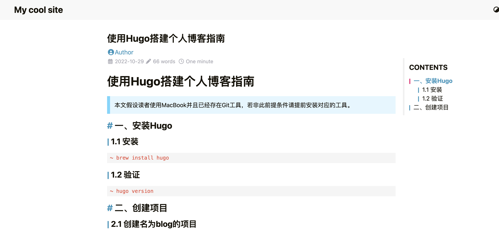
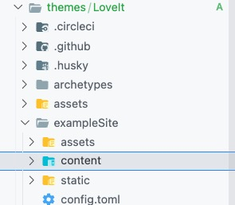
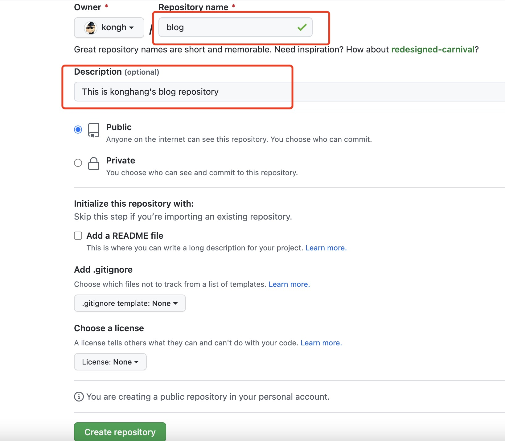
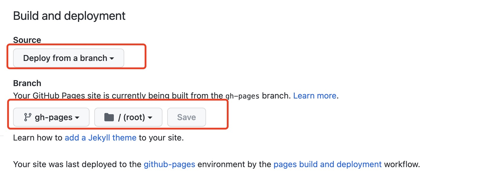

# 使用Hugo搭建个人博客指南

> 本文假设读者使用MacBook并且已经存在Git工具，若非此前提条件请提前安装对应的工具。

## 一、安装Hugo

### 1.1 安装

```shell
~ brew install hugo
```

### 1.2 验证

```shell
~ hugo version
```

## 二、创建项目

### 2.1 创建名为blog的项目

```shell
~ hugo new site blog
```

### 2.2 打开项目

本文使用 `vscode`来编写 `Markdown`文件，你可以选择任何编辑器来编写。但是，我们推荐你使用 `vscode`, 同时，这里有一份[安装指南](/posts/vscode-markdown-editor "安装指南")提供参考。

### 2.3 初始化成git项目

```shell
~ git init
~ git branch -m main
~ git add .
~ git commit -m "init"
```

### 2.4 添加主题

```shell
~ git submodule add https://github.com/dillonzq/LoveIt.git themes/LoveIt
```

### 2.5 修改配置文件，添加主题

打开 `config.toml`文件,增加 `theme = "LoveIt"`配置。

### 2.6 创建第一篇文章

```shell
~ hugo new posts/hugo-blog-guide/index.md
```

### 2.7 本地启动服务器，查看效果

```shell
~ hugo server -D
```

使用浏览器打开后，应该会看到如下效果。


## 三、优化项目

### 3.1 主题LoveIt的示例项目

在项目下 `themes/LoveIt/exampleSite`目录是例子的根目录。


首先，我们重点关注下 `config.toml`。由于篇幅比较大，特意将文件放到了另外一篇文章。点击[查看配置示例](/posts/hugo-loveit-config)。

### 3.2 调整项目配置

#### 3.2.1 基础配置

拷贝如下内容到 `config.yaml`文件内，修改成你需要的样子，重启查看效果。

```toml
# 修改为你的发布地址
baseURL = "https://example.com"

# theme
# 主题
theme = "LoveIt"

# website title
# 网站标题
title = "Kong Hang's Blog"

# determines default content language ["en", "zh-cn", "fr", "pl", ...]
# 设置默认的语言 ["en", "zh-cn", "fr", "pl", ...]
defaultContentLanguage = "en"
# language code ["en", "zh-CN", "fr", "pl", ...]
# 网站语言, 仅在这里 CN 大写 ["en", "zh-CN", "fr", "pl", ...]
languageCode = "en"
# language name ["English", "简体中文", "Français", "Polski", ...]
# 语言名称 ["English", "简体中文", "Français", "Polski", ...]
languageName = "English"
# whether to include Chinese/Japanese/Korean
# 是否包括中日韩文字
hasCJKLanguage = false

# default amount of posts in each pages
# 默认每页列表显示的文章数目
paginate = 12
# google analytics code [UA-XXXXXXXX-X]
# 谷歌分析代号 [UA-XXXXXXXX-X]
googleAnalytics = ""
# copyright description used only for seo schema
# 版权描述，仅仅用于 SEO
copyright = "Kong Hang's Blog"

# whether to use robots.txt
# 是否使用 robots.txt
enableRobotsTXT = true
# whether to use git commit log
# 是否使用 git 信息
enableGitInfo = true
# whether to use emoji code
# 是否使用 emoji 代码
enableEmoji = true

# ignore some build errors
# 忽略一些构建错误
ignoreErrors = ["error-remote-getjson", "error-missing-instagram-accesstoken"]

# Author config
# 作者配置
[author]
  name = "KongHang"
  email = "563796329@qq.com"
  link = "https://github.com/kongh"
```

#### 3.2.2 配置导航栏

```toml
# Menu config
# 菜单配置
[menu]
  [[menu.main]]
    weight = 1
    identifier = "posts"
    # you can add extra information before the name (HTML format is supported), such as icons
    # 你可以在名称 (允许 HTML 格式) 之前添加其他信息, 例如图标
    pre = ""
    # you can add extra information after the name (HTML format is supported), such as icons
    # 你可以在名称 (允许 HTML 格式) 之后添加其他信息, 例如图标
    post = ""
    name = "Posts"
    url = "/posts/"
    # title will be shown when you hover on this menu link
    # 当您将鼠标悬停在此菜单链接上时, 将显示标题
    title = ""
  [[menu.main]]
    weight = 2
    identifier = "tags"
    pre = ""
    post = ""
    name = "Tags"
    url = "/tags/"
    title = ""
  [[menu.main]]
    weight = 3
    identifier = "categories"
    pre = ""
    post = ""
    name = "Categories"
    url = "/categories/"
    title = ""
```

#### 3.2.3 配置params

```toml
[params]
  # website title for Open Graph and Twitter Cards
  # 网站标题, 用于 Open Graph 和 Twitter Cards
  title = "Kong Hang's Blog"
  # website description for RSS, SEO, Open Graph and Twitter Cards
  # 网站描述, 用于 RSS, SEO, Open Graph 和 Twitter Cards
  description = "Kong Hang's Blog"
  # website images for Open Graph and Twitter Cards
  # 网站图片, 用于 Open Graph 和 Twitter Cards
  images = []

  # Header config
  # 页面头部导航栏配置
  [params.header]
    # Header title config
    # 页面头部导航栏标题配置
    [params.header.title]
      # title name
      # 标题名称
      name = "Kong Hang's Blog"
      # you can add extra information before the name (HTML format is supported), such as icons
      # 你可以在名称 (允许 HTML 格式) 之前添加其他信息, 例如图标
      pre = "<i class='far fa-kiss-wink-heart fa-fw' aria-hidden='true'></i>"
    
  # App icon config
  # 应用图标配置
  [params.app]
    # optional site title override for the app when added to an iOS home screen or Android launcher
    # 当添加到 iOS 主屏幕或者 Android 启动器时的标题, 覆盖默认标题
    title = "Kong Hang's Blog"

  # Home page config
  # 主页信息设置
  [params.home]
    # Home page profile
    # 主页个人信息
    [params.home.profile]
      enable = true
      # subtitle shown in home page (HTML format is supported)
      # 主页显示的网站副标题 (允许 HTML 格式)
      subtitle = "Stay Hungry Stay Foolish!!!"
      # whether to use typeit animation for subtitle
      # 是否为副标题显示打字机动画
      typeit = true
      # whether to show social links
      # 是否显示社交账号
      social = true
      # disclaimer (HTML format is supported)
      # 免责声明 (支持 HTML 格式)
      disclaimer = ""
    # Home page posts
    # 主页文章列表
    [params.home.posts]
      enable = true
      # special amount of posts in each home posts page
      # 主页每页显示文章数量
      paginate = 6
```

## 四、使用GitHub托管项目

### 4.1 创建空项目

按如图填写项目名称和描述创建一个空项目。



### 4.2 推送至远程仓库

``` shell
~ git remote add origin https://github.com/kongh/blog.git
~ git push -u origin main
```

### 4.3 发布项目到Github Pages

在项目目录下新增`.github/workflows/gh-pages.yml`文件，添加如下内容：

``` yaml
name: github pages

on:
  push:
    branches:
      - main  # Set a branch to deploy
  pull_request:

jobs:
  deploy:
    runs-on: ubuntu-22.04
    steps:
      - uses: actions/checkout@v3
        with:
          submodules: true  # Fetch Hugo themes (true OR recursive)
          fetch-depth: 0    # Fetch all history for .GitInfo and .Lastmod

      - name: Setup Hugo
        uses: peaceiris/actions-hugo@v2
        with:
          hugo-version: 'latest'
          # extended: true

      - name: Build
        run: hugo --minify

      - name: Deploy
        uses: peaceiris/actions-gh-pages@v3
        if: github.ref == 'refs/heads/main'
        with:
          github_token: ${{ secrets.GITHUB_TOKEN }}
          publish_dir: ./public
```

然后提交代码后会自动构建出`gh-pages`分支，然后，点击`Settings`-`Code and automation`-`Pages`，修改Github Pages Branch为`gh-pages`。


