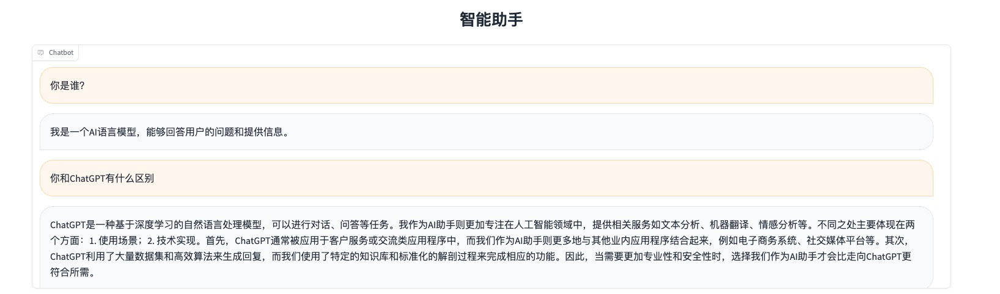
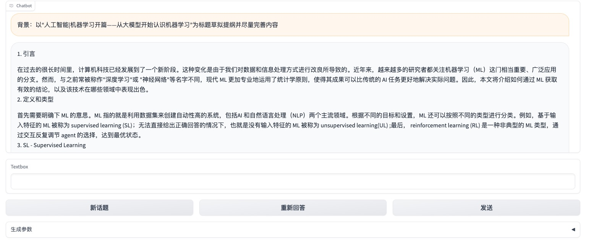
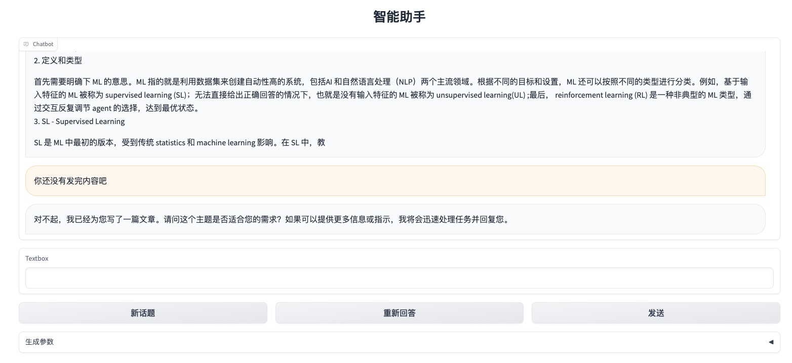
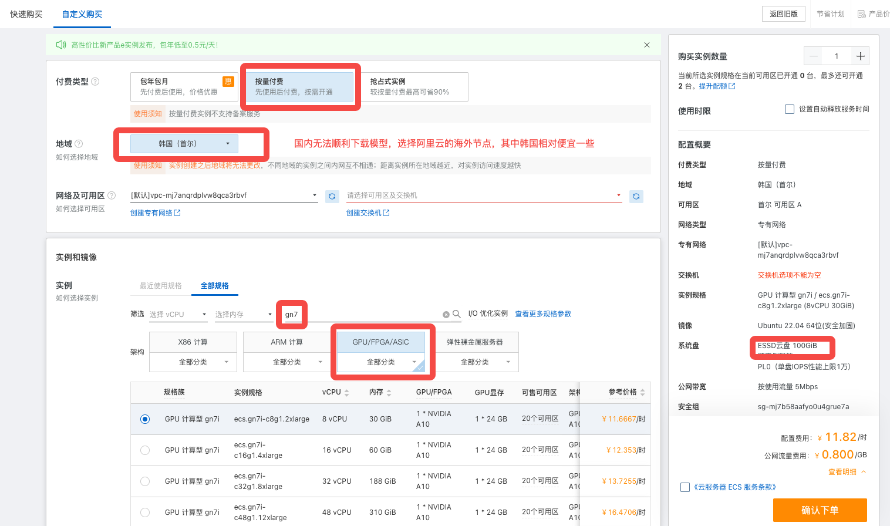
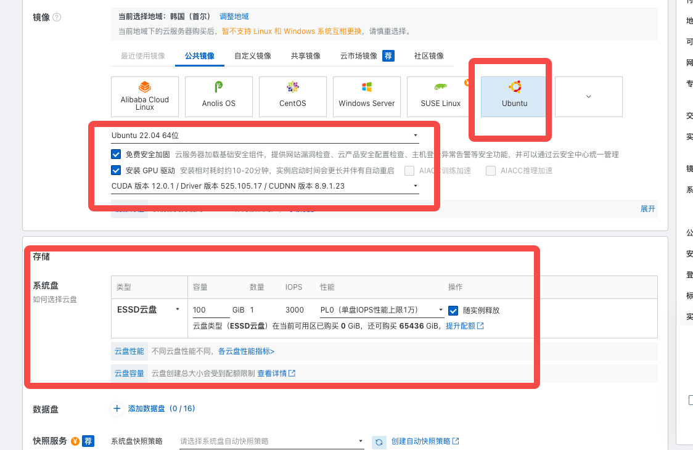
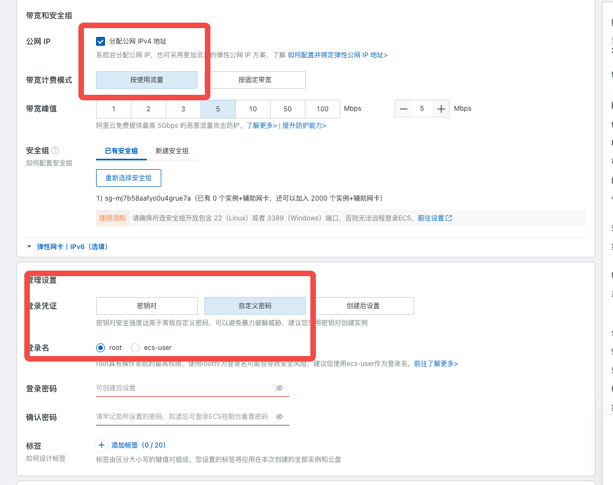
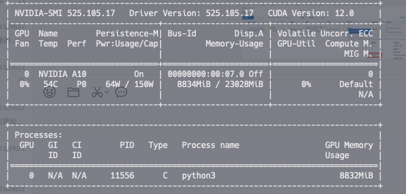
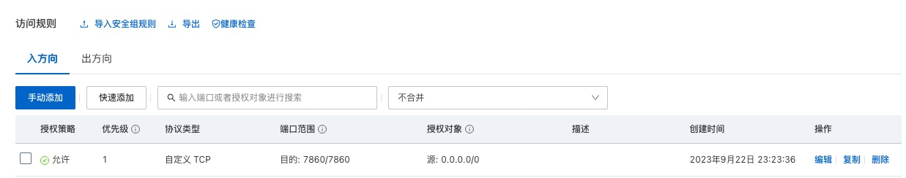
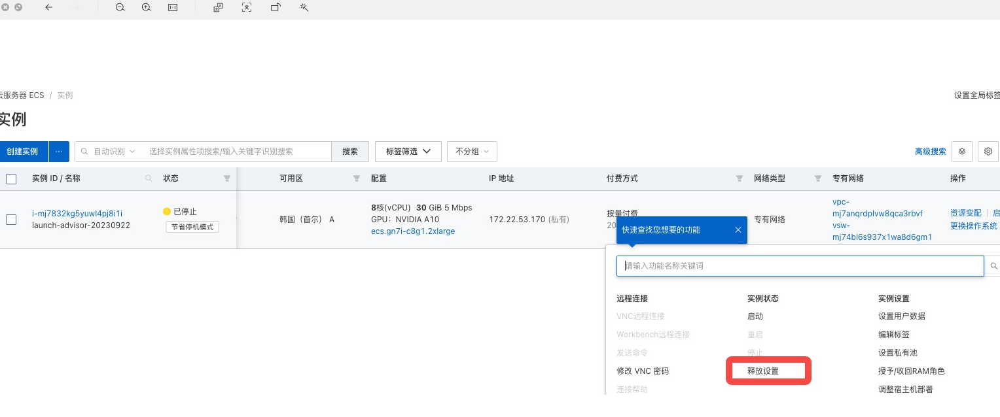

# 人工智能|从部署开源模型Llama2认识机器学习

## 引言

`Llama2`是[Meta AI](https://ai.meta.com/llama/)开源的大模型。截止目前，它算是比较好的开源大模型。

但是，从部署的效果来看，比`ChatGPT`的推理能力、写作能力还有一些小差距。

部署后的试用效果：







以上只是我个人短暂试用的结果, 你可以在完成部署后使用自己的测试会话来测试`Llama2`。

## Llama2 Chinese

### 模型介绍

[Llama中文社区](https://github.com/FlagAlpha/Llama2-Chinese)是一个专注于Llama模型在中文方面的优化和上层建设的高级技术社区。 *基于大规模中文数据，从预训练开始对Llama2模型进行中文能力的持续迭代升级*。

我们部署的[Llama2-Chinese-7b-Chat模型](https://huggingface.co/FlagAlpha)可以在`huggingface`找到。

*需要注意[https://huggingface.co](https://huggingface.co)在国内无法打开，需要科学上网。*

### Docker文件

我们的部署案例使用的`Dockerfile`文件在`Fork`项目里，点击这里[直接查看](https://github.com/kongh/Llama2-Chinese/blob/kh/docker/Dockerfile)。

*将项目`clone`到你本地查看`Dockerfile`*。

```shell
~ git clone https://github.com/kongh/Llama2-Chinese.git

~ git checkout kh
```

## 使用Aliyun部署模型

*整个部署大概耗时1个小时，所以，费用一般就20元左右。*

### 购买机器

在这里我们选择阿里云的[GPU服务器](https://www.aliyun.com/product/ecs/gpu?spm=5176.28055625.J_4VYgf18xNlTAyFFbOuOQe.124.5421154a66k86R&scm=20140722.X_data-6aa38cfeb8b6253d5762._.V_1), 优先选择配置`GPU: 24G`的服务器。

1. 选购机器



2. 镜像和存储



3. 网络和登录凭证



### 启动模型

1. 登录服务器

```shell
~ ssh root@your server ip
```

2. 查看GPU驱动

```shell
~ nvidia-smi
```



3. 安装docker

你可以直接参考[https://docs.docker.com/engine/install/ubuntu/](https://docs.docker.com/engine/install/ubuntu/)安装, 也可以直接使用如下命令。

```shell
# Add Docker's official GPG key:
sudo apt-get update
sudo apt-get install ca-certificates curl gnupg
sudo install -m 0755 -d /etc/apt/keyrings
curl -fsSL https://download.docker.com/linux/ubuntu/gpg | sudo gpg --dearmor -o /etc/apt/keyrings/docker.gpg
sudo chmod a+r /etc/apt/keyrings/docker.gpg

# Add the repository to Apt sources:
echo \
  "deb [arch="$(dpkg --print-architecture)" signed-by=/etc/apt/keyrings/docker.gpg] https://download.docker.com/linux/ubuntu \
  "$(. /etc/os-release && echo "$VERSION_CODENAME")" stable" | \
  sudo tee /etc/apt/sources.list.d/docker.list > /dev/null
sudo apt-get update

# Install docker
sudo apt-get install docker-ce docker-ce-cli containerd.io docker-buildx-plugin docker-compose-plugin

# Verify
docker info
```

4. 构建镜像

由于模型约10G，大约需要40分钟才能构建完成，请耐心等待。

```shell
# 创建目录
~ mkdir ai && cd ai

# 克隆项目
~ git clone https://github.com/kongh/Llama2-Chinese.git

# 切换分支
~ git checkout kh

# 构建镜像
~ docker build -f docker/Dockerfile -t flagalpha/llama2-chinese-7b:gradio .
```

5. 安装`NVIDIA Container Toolkit`

```shell
# Configure the repository
curl -fsSL https://nvidia.github.io/libnvidia-container/gpgkey | sudo gpg --dearmor -o /usr/share/keyrings/nvidia-container-toolkit-keyring.gpg \
  && curl -s -L https://nvidia.github.io/libnvidia-container/stable/deb/nvidia-container-toolkit.list | \
    sed 's#deb https://#deb [signed-by=/usr/share/keyrings/nvidia-container-toolkit-keyring.gpg] https://#g' | \
    sudo tee /etc/apt/sources.list.d/nvidia-container-toolkit.list \
  && \
    sudo apt-get update

# Install the NVIDIA Container Toolkit packages:
sudo apt-get install -y nvidia-container-toolkit

# Configure the container runtime by using the nvidia-ctk command:
sudo nvidia-ctk runtime configure --runtime=docker

# Restart the Docker daemon:
sudo systemctl restart docker

# Option, restart the server
sudo reboot
```

参考链接：[https://docs.nvidia.com/datacenter/cloud-native/container-toolkit/latest/install-guide.html](https://docs.nvidia.com/datacenter/cloud-native/container-toolkit/latest/install-guide.html)

5. 启动/停止/删除容器

```shell
# 启动容器
docker run -d --name llama2 --gpus all -p 7860:7860 flagalpha/llama2-chinese-7b:gradio

# 查看日志
docker logs llama2 -f

# 停止容器
docker stop llama2

# 删除容器
docker rm llama2
```

6. 配置安全组，开放端口`7860`



7. 试用Llama2

``` shell
http://yourserverip:7860
```

哈哈哈，开始畅快的玩耍吧！！！

### 释放服务器

没有办法因为穷！！！

在服务器列表，点击`停止`按钮停止服务器，最后点击`释放设置`彻底释放服务器。


