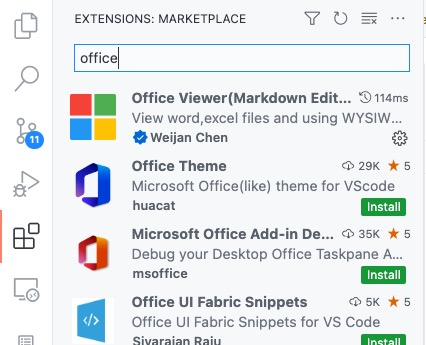
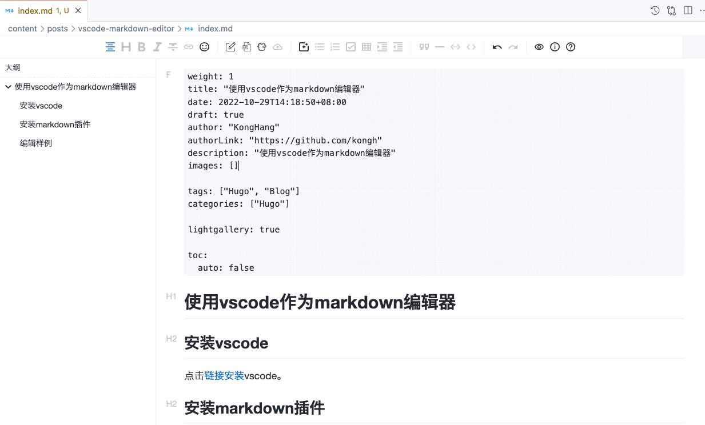

# 使用vscode作为markdown编辑器

# 使用vscode作为markdown编辑器

## 安装vscode

点击[链接安装](https://code.visualstudio.com/download "安装vscode")vscode。

## 安装markdown插件

点击侧边栏 `Extensions`,输入 `Office Viewer`安装所见即所得 `Markdown`插件。

## 编辑器样例

